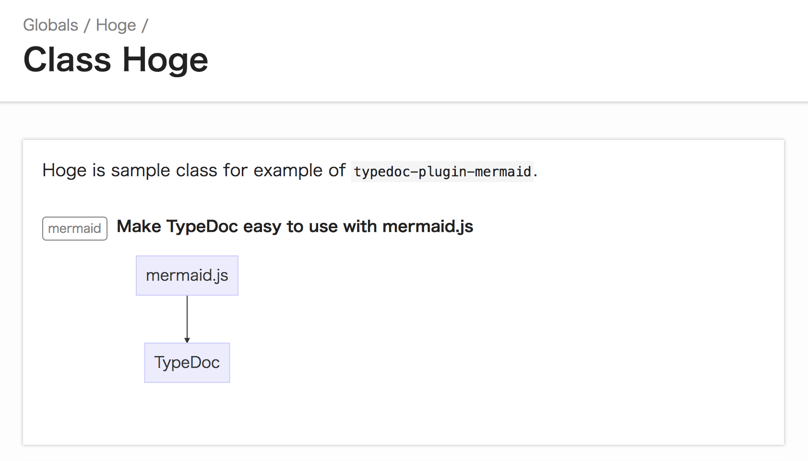

[](https://github.com/kamiazya/typedoc-plugin-mermaid/actions?workflow=Node+CI) [](https://www.codefactor.io/repository/github/kamiazya/typedoc-plugin-mermaid) [](https://badge.fury.io/js/typedoc-plugin-mermaid) [](https://codeclimate.com/github/kamiazya/typedoc-plugin-mermaid/maintainability) [](https://codeclimate.com/github/kamiazya/typedoc-plugin-mermaid/test_coverage) [](https://app.fossa.io/projects/git%2Bgithub.com%2Fkamiazya%2Ftypedoc-plugin-mermaid?ref=badge_shield) [](https://opensource.org/licenses/MIT) [](https://devtoken.rocks/package/typedoc-plugin-mermaid) [](https://bettercodehub.com/)

# typedoc-plugin-mermaid

A plugin for TypeDoc that generates graphs for mermaid.js diagrams by @mermaid annotation.

## Installation

The plugin can then be installed using [npm](https://www.npmjs.com/):

[](https://nodei.co/npm/typedoc-plugin-mermaid/)

### npm

```sh
npm install --save-dev typedoc-plugin-mermaid
```

### yarn

```sh
yarn add -D typedoc-plugin-mermaid
```

## Usage

Write tsdoc with `@mermaid` annotation

```typescript
/**
 * Hoge is sample class for example of `typedoc-plugin-mermaid`.
 *
 * @mermaid Make TypeDoc easy to use with mermaid.js
 * graph TB
 *   mermaid.js --> TypeDoc;
 */
export class Hoge { }
```

[↓↓ DEMO ↓↓](https://kamiazya.github.io/typedoc-plugin-mermaid/classes/hoge.html)

[](https://kamiazya.github.io/typedoc-plugin-mermaid/classes/hoge.html)

## Additional Options

### Example: If you want to use `mermaid.js@8.0.0`

#### Set version by CLI

Add `-mmv/--mermaidVersion 8.0.0` option.

```bash
$ typedoc --plugin typedoc-plugin-mermaid --mermaidVersion 8.0.0
or
$ typedoc --plugin typedoc-plugin-mermaid -mmv 8.0.0
```

#### Set version by `typedoc.json`

Add `vermaidVersion` config to `typedoc.json`.

```json
{
  "mode": "file",
  "out": "../docs",
  "vermaidVersion": "8.0.0"
}
```

### Help

```bash
$ typedoc --plugin typedoc-plugin-mermaid -h
Loaded plugin typedoc-plugin-mermaid
Usage:
 typedoc --mode modules --out path/to/documentation path/to/sourcefiles

TypeDoc options:
...

 -mmv, --mermaidVersion    Mermaid Plugin: Version of mermaid.js.

...

TypeScript options:
See https://www.typescriptlang.org/docs/handbook/compiler-options.html
```

## License

This software is released under the MIT License, see LICENSE.

[](https://app.fossa.io/projects/git%2Bgithub.com%2Fkamiazya%2Ftypedoc-plugin-mermaid?ref=badge_large)

## Author

[kamiazya(Yuki Yamazaki)](https://github.com/kamiazya)

[](https://ko-fi.com/W7W5VDNO)
